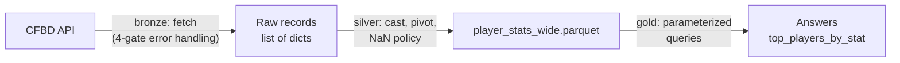

# cfb-stats-pipeline

An end-to-end **bronze / silver / gold data pipeline** in Python over the [CollegeFootballData (CFBD) API](https://collegefootballdata.com/) — hardened ingestion, typed transformations, Parquet persistence, and a parameterized query layer.

## Why this exists

I build and operate a production medallion lakehouse (Databricks / Delta / Spark) for infrastructure telemetry at a large bank. This project applies the same architectural discipline — layered refinement, defensive ingestion, evidence-based data-quality decisions, and a clean separation between *producing* data and *answering questions with it* — at portfolio scale, where every line is mine and every design decision is documented below.

## Architecture



| Layer | File | Responsibility |
|---|---|---|
| Bronze | `lookup.py`, `pipeline.py` | Fetch season player stats from the CFBD API with gated error handling; fail soft per team, never silently |
| Silver | `silver.py`, `pipeline.py` | Cast stat values from strings to `float64`, pivot long → wide (one row per player/category), apply the NaN policy, persist to Parquet, round-trip verify |
| Gold | `gold.py` | Read the silver artifact and answer questions via `top_players_by_stat(category, stat, n)` with input validation |

`pipeline.py` runs the full path end-to-end across multiple teams and writes the silver artifact to `data/silver/` (gitignored — artifacts are rebuilt, not committed).

## Design decisions

**Ingestion is gated, not hopeful.** Every fetch passes through independent checks — connection failure, non-200 HTTP status, empty response, and data-shape correctness — each with its own failure message. A `None` return is an explicit failure signal, which means a downstream consumer can never mistake a failed pull for an empty-but-valid one.

**Multi-team pulls fail soft.** If one team's fetch fails, that team is skipped and logged; the run continues. One bad source shouldn't kill a batch — the same principle that governs multi-source reconciliation in a production pipeline.

**Stats are cast at the silver boundary, not before and not lazily.** The API returns every stat as a string (`"10.0"`, `"1"`). Bronze preserves what the source sent; silver is where typing becomes a guarantee. After the cast, every stat column is `float64` — verified, not assumed.

**NaN is left intact, deliberately.** After the long-to-wide pivot, a player with no `TD` stat in a category shows NaN. I profiled TD presence by category before deciding: these NaNs mean *not applicable* (a kicker has no passing TDs), not *missing*. Filling them with 0 would fabricate a claim the source never made — a punter with "0 passing TDs" looks like a measured fact. Leaving NaN preserves the distinction between "measured as zero" and "never measured," which means aggregations stay honest (`count` vs `size` diverge exactly where they should).

**Parquet, not CSV.** Parquet carries its schema — the `float64` typing earned at silver survives the write. A CSV round-trip would re-stringify everything and silently discard the layer's whole contribution. The pipeline verifies this with a round-trip check: reload the artifact and assert dtype and NaN counts survived.

**Gold answers questions; it doesn't build data.** The gold layer never touches the API and never re-derives silver — it reads the Parquet artifact and serves parameterized queries with validated inputs. Producing trusted data and consuming it are different jobs with different failure modes, so they live in different layers.

## Setup

Requires Python 3.11+ and a free [CFBD API key](https://collegefootballdata.com/key).

```bash
git clone https://github.com/codedtech824/cfb-stats-pipeline.git
cd cfb-stats-pipeline
python -m venv .venv
.venv\Scripts\activate        # Windows  (source .venv/bin/activate on macOS/Linux)
pip install requests pandas python-dotenv pyarrow
```

Create a `.env` file in the project root (gitignored — the key never leaves your machine):

```
CFBD_API_KEY=your_key_here
```

## Run

```bash
python pipeline.py   # bronze → silver: fetch, transform, persist, verify
python gold.py       # gold: query the silver artifact
```

Example output from the pipeline run:

```
Total records across 5 teams: 2417
Wide shape: (1032, 25)
Silver artifact written: data/silver/player_stats_wide.parquet
--- Round-trip check ---
Stat column dtype (should be float64): float64
```

## Roadmap

- `pytest` suite covering the ingestion gates and the silver typing guarantees
- Incremental loads (per-week fetches merged into the season artifact) instead of full refresh
- Orchestration (scheduled runs) and basic run-level logging
- dbt models over the silver layer as an alternative gold implementation
- Port to Databricks / Delta tables to mirror the production pattern end-to-end
